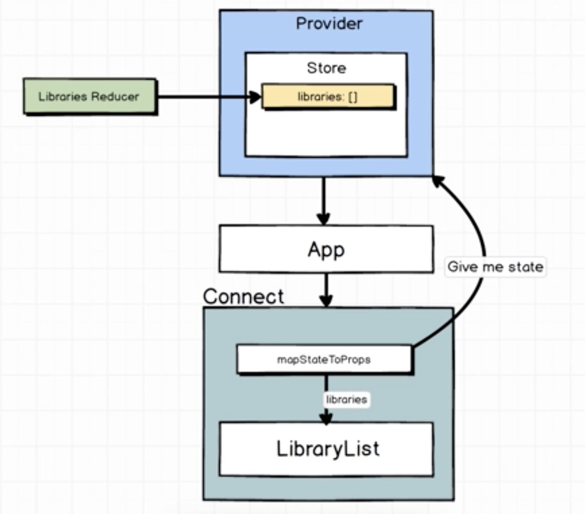

<h4>1/1/18<h4>

<b>Set Up</b>:
1. Create SRC folder and create App.js file

<b>Section 11, Lecture 83: More on Redux Boilerplate:</b>
1.Import Provider and CreateStore from react-redux and redux 
2. Wrap View in Provider tags. pass store={createStore}
3. Create reducers folder in src. create index.js 
4. Connect reducers to App.js and pass in createStore

<b>Section 12, Lecture 84: Rendering the Header</b>
1. Copy over common components
2. Provider can only have 1 child component
3. Wrap header in view tag

<b>Section 12, Lecture 85: Reducer State and Design</b>
1. Reducers produce application state, application state holds all data. reducer is a function that returns some amount of data
2. Needs two distinct states: 1. A list of libraries 2. Currenty selected library. Because two seperate pieces of state --> two reducers

<b>Section 12, Lecture 86: Library list of data</b>
1. Create new reducer that will return static list of libraries
2. Create new file LibraryReducer.js and connect to index.js
3. console.log(store.getState()) will result in libraries:[]

<b>Section 12, Lecture 88: The connect function</b>
1. Connect LibraryList.json to LibraryReducer.js
2. Connect helper is the only way to get redux store from react
3. Create file LibraryList.js and add connect helper to LibraryList.js

<b>Section 12, Lecture 89: MapToStateProps w/ Connect</b>
1. mapStateToProps will take some specified state and will provide it as props to a component specified
2. Then, that component can console.log the data using props

<b>Section 12. Lecture 90: A quick review</b>

1. When app boots up, redux creates a new store (using createStore call using Libraries reducer)
2. Runs onetime which creates a piece of state called libraries
3. We pass the store to the provider as a prop where it will remain for the rest of the lifespan of the application
	a. Provider is a react component that acts in the communication between react and redux
4. App component is rendered to the screen which in turn renders the LibraryList component
5. Connect function reaches back up to Provider to ask for state. Connect then provides to LibraryList by filtering through MapStateToProps

<b>Section 13, Lecture 92: ListView in Practice</b>
1. ListView only renders the components that are visible making performance much better
2. Add Listview Boilerplate, then connect to this.props.libraries which works because we've already set up MapStateToProps
3. Return ListView in the render method

<b>Section 13, Lecture 93: Rendering a Single Row </b>
1. We need to tell ListView how to render each component
2. Create a component called ListItem.js

<b>Section 13, Lecture 94: Styling the List </b>
1. Use CardSection from common
2. Add styles
2. Extend View tag to take up all the space

<b>Section 13, Lecture 95: Creating Selection Reducer </b>
1. When Title is clicked, we want to expand to show description
2. Will build a selection reducer -> purpose is to record what the currently selected library is using currently selected ID
3. Initial value of reducer cannot be undefined
4. For every reducer we create, we have to wire it up to index.js in the reducers file

<b>Section 13, Lecture 96: Introducing Action Creators </b>
1. an Action Creator is a javascript object that returns an action
2. An object with a type property is an action and an action is how we cause the reducers to update the data that they produce
3. If you want to export many things from the same file, you use just export not export default
4. Add connect so we communicate with the redux portion
5. first argument of connect is mapstatetoprops. since no mapstatetoprops, make it null. Second argument pass in actions
6. Actions argument in connect function is doing two things:
	a. whenever it is called it will call action item which will change redux store
	b. takes all actions and passes to component as props
7. Basically, anything using connect helper modifies so that component recieves it as props